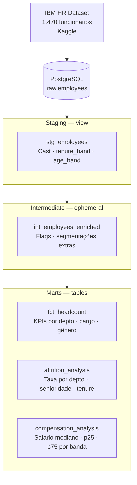

# 👥 HR People Analytics — dbt + PostgreSQL


> **Analytics Engineering project:** Modelagem de dados de RH com dbt sobre o dataset IBM HR Analytics (1.470 funcionários) — análise de attrition por departamento/senioridade, KPIs de headcount e análise salarial com mediana via `percentile_cont`.

---

## 🏗️ Arquitetura dbt



---

## 💡 Problema de Negócio

Alta rotatividade é um dos maiores custos ocultos de RH. Este projeto responde: **em quais departamentos o attrition é mais alto? Existe relação entre salário abaixo da mediana e saída?** Os modelos entregam respostas prontas para o CHRO tomar decisões baseadas em dados.

---

## 📦 Modelos dbt

| Modelo | Camada | Tipo | Descrição |
|---|---|---|---|
| `stg_employees` | Staging | View | Funcionários com `tenure_band` e `age_band` categorizados |
| `int_employees_enriched` | Intermediate | Ephemeral | Flags de risco de attrition + faixa salarial |
| `fct_headcount` | Mart | Table | Headcount e distribuição por departamento, cargo e gênero |
| `attrition_analysis` | Mart | Table | Taxa de attrition por depto, cargo, tempo de empresa e faixa etária |
| `compensation_analysis` | Mart | Table | Mediana, P25 e P75 salarial por cargo e banda de senioridade |

---

## 🔑 Destaques Técnicos

- **`percentile_cont`**: mediana salarial real (não média) calculada com função de window analítica — elimina distorção por outliers
- **`tenure_band` dinâmico**: categorização de tempo de empresa com `CASE WHEN` em staging, reutilizada em todos os marts
- **Attrition rate**: `SUM(CASE WHEN attrition = 'Yes' THEN 1 ELSE 0 END)::FLOAT / COUNT(*)` — calculado por múltiplas dimensões
- **dbt tests**: `not_null` e `unique` em `employee_id`; `accepted_values` em campos categóricos críticos
- **Port isolado**: PostgreSQL na porta 5433 para não conflitar com outros projetos do portfólio

---

## 📊 Sample Output — attrition_analysis

| department | tenure_band | total | attrited | attrition_rate |
|---|---|---|---|---|
| Sales | 0-2 anos | 120 | 34 | 28.3% |
| R&D | 5-10 anos | 85 | 6 | 7.1% |
| HR | 2-5 anos | 40 | 12 | 30.0% |

---

## 🚀 Como Executar

```bash
# 1. Clone o repositório
git clone https://github.com/santosalmeida1708/hr-people-analytics-dbt.git
cd hr-people-analytics-dbt

# 2. Suba o banco (porta 5433)
docker compose up -d

# 3. Carregue os dados
pip install -r requirements.txt
python scripts/load_hr_data.py

# 4. Execute o projeto dbt
dbt deps && dbt run && dbt test

# 5. Documentação
dbt docs generate && dbt docs serve
```

---

## 🎯 Skills Demonstradas

`dbt` · `SQL avançado` · `PostgreSQL` · `percentile_cont` · `Window Functions` · `Attrition Analysis` · `HR Analytics` · `Data Modeling` · `dbt Tests` · `Docker`

---

## 📈 Próximas Evoluções

- [ ] Modelo de previsão de attrition com Python + scikit-learn
- [ ] Dashboard de People Analytics no Metabase
- [ ] Integração com dados de recrutamento (time-to-hire)
